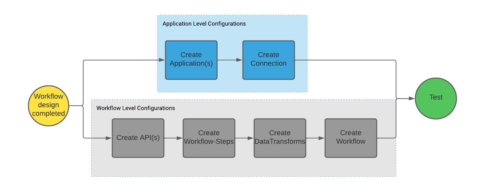
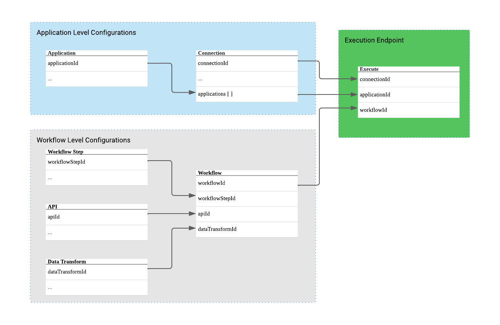

# Configuration Guide

## Introduction

This document is intended to provide an overview of the configuration objects present in the Nordic Health Data Connector. It is recommended that configuration elements are interacted with using the CRUD endpoints provided to ensure that data integrity, access control, and security is maintained. 

## Interacting with REST Endpoints - CRUD

The Health Data Connector is designed for easy configurability via REST endpoints. Full CRUD operations are available for each configuration element including:

- Applications
- Connections
- APIs
- Workflow Steps
- Data Transforms
- Workflows

### Build Order - Configurable Elements

The Health Data Connector relies on all configurable elements to create an executable workflow. Each configurable element is built with the intention of reusability resulting in interdependency of elements. The following build order is recommended when creating net new executable workflows:



### Configuration Relationship Diagram



## Application Level Configurations

:::info
All configuration parameters are string values unless explicitly stated.
:::

### Applications

#### Definition

Application level configurations hold data related to the application registered with the EHR. This configuration contains information such as client-id, secret, and scope. Application level configurations are required to complete SMART on FHIR, FHIR, or REST actions. 

### Configuration Parameters

Application level configurations hold data related to the application registered with the EHR. This configuration contains information such as client-id, secret, and scope. Application level configurations are required to complete SMART on FHIR, FHIR, or REST actions. 


|Name|Description|Required?|Notes|
|:-|:-|:-|:-|
| applicationId| Unique ID used to store and refer to the application configuration.| Yes| Must be unique|
| name| Vanity name for human readable purposes.| Yes| |
| appType| Application type associated with the application registered to the EHR.| Yes| Enum: <ul><li>Backend</li><li>ProviderLaunch</li><li>PatientLaunch</li></ul>|
| ClientId| Client ID is a value provided by the EHR vendor to uniquely identify the application when communicating with the EHR.| Yes| |
| scopes| Used to identify the scopes associated with the application.| Conditional| Required for SMART launch configuration.|
| privateKeyName| Workflow Id to execute upon a SMART launch success.| Yes| |
| authSuccessWorkflowId| Workflow Id to execute upon a SMART launch success. | Conditional| Required for SMART launch configuration.|
| authFailureWorkflowId | Workflow Id to execute upon a SMART launch failure.| Conditional| Required for SMART launch configuration.|
| launchParameters| Defines launch parameters for SMART launch configuration.| Conditional| Required for SMART launch configuration.|

### Example Application Configuration

```
{
  "applicationId": "application-smart-foundation-01",
  "name": "Application - Foundation SMART Launch Configuration - 01",
  "appType": "Backend",
  "clientId": "[clientId]",
  "scopes": [
    "fhiruser",
    "launch",
    "openid",
   "profile"
 ],
 "privateKeyName": "Authentication_Key",
 "audience": "https://fhir.epic.com/interconnect-fhir-oauth/oauth2/token",
 "authSuccessRedirectUrl": "https://www.nordicglobal.com",
 "authFailureRedirectUrl": "https://www.google.com"
}
```

### Connections

#### Definition

Holds configurations related to a connection for an EHR or other resource provider. Contains information such as the base url, authorization endpoint, and applications approved to use the connection.

#### Configuration Parameters

|Name|Description|Required?|Notes|
|:-|:-|:-|:-|
| connectionId| Unique ID used to store and refer to the connection configuration.| Yes| Must be unique|
| baseUrl| URL of the server where connections will be made.| Yes| Trailing '/' should not be included.|
| extension| Pathway to the resource location.| Yes| Preceding and trailing '/' should not be included.|
| audience| | | |
| openIdConfigurationEndpoint| Location of the Open ID configuration.| Conditional| Required for SMART launch.|
| tokenEndPoint| Pathway to the token end point used for OAuth.| Yes| |
| authorizeEndPoint| !| | |
| conformanceStatementPath| Instructions for the pathway to the conformance statement.| Conditional| Required for SMART launch. Can use “metadata”.|
| applications | List of applications that have permission to use the connection.| Yes| List Type Required to execute a workflow using the connection and application configurations.|
| oAuthHeaders| Headers added to the OAuth request for authentication.| Yes| Object type|

### Example Connection Configuration

```
{
  "connectionId": "connection-smart-foundation-01",
  "baseUrl": "https://fhir.epic.com/interconnect-fhir-oauth",
  "extension": "api/FHIR/R4",
  "audience": "https://fhir.epic.com/interconnect-fhir-oauth/oauth2/token",
  "openIdConfigurationEndpoint": "oauth2/.well-known/openid-configuration",
  "tokenEndPoint": "https://fhir.epic.com/interconnect-fhir-oauth/oauth2/token",
  "authorizeEndPoint": null,
  "conformanceStatementPath": "metadata",
  "applications": {
    "application-smart-foundation-01": {
                "privateKeyName": "Authentication_Key",
                "authSuccessWorkflowId": "workflow-smart-foundation-01",
                "authFailureWorkflowId": "smartfailworkflow",
                "launchParameters": {
                    "patientId": "patient"
                }
             }
  },
  "oAuthHeaders": {
    "Accept": "application/fhir+json",
    "Epic-Client-ID": "[clientId]"
  }
}
```

## Workflow Level Configurations

:::info
All configuration parameters are string values unless explicitly stated.
:::

### APIs

#### Definition:

Definitions for outbound API calls to enable specific API call configuration (e.g., FHIR GET Patient.Search with query parameters to return only patients that match a specific criteria). This configuration contains information such as API path, header parameters, http operation, and query parameters.

|Name|Description|Required?|Notes|
|:-|:-|:-|:-|
| apiId| Unique ID used to store and refer to the application configuration.| Yes| Must be unique|
| name| Vanity name for human readable purposes.| Yes| |
| headerParameters| Header parameters added to the API request.| Yes| Object Type|
| bodyTemplate| References a templateId for use when tokenizing and hydrating a string.| No| |
| dataFormat| Used to identify the scopes associated with the application.| Yes| *Must use one of the following types:* <ul><li>FhirJson</li><li>FhirXml</li><li>Json</li></ul>|
| apiPath| Path to the API when combined with the base URL defined in the Connection.| Yes| Preceding and trailing '/' should not be included.|
| requestMethod| Operation to be performed by the request.| Yes| *Must use one of the following types:* <ul><li>GET</li><li>POST</li><li>UPDATE</li><li>DELETE</li></ul>|
| queryParameters | Parameters to be added to the request.| No| List Type containing one Object|

### Example API Configuration

```
{
    "apiId": "api-smart-foundation-01",
    "name": "API - Foundation SMART Launch Configuration - 01",
    "headerParameters": {},
    "bodyTemplateID": "concattemplate",
    "dataFormat": "Json",
    "apiPath": "api/FHIR/R4/Patient",
    "requestMethod": "GET",
    "queryParameters": [
        {
            "key": "identifier",
            "value": "patId",
            "operator": "",
            "valueType": "Value"
        },
        {
            "key": "date",
            "value": "w-4",
            "valueType": "Date",
            "operator": "gt"
        }
    ]
}
```

### API Body Template

A template can be used to arrange the body parameters as needed. In the example below, a template is used to concatenate the id and idType as an input for the Patient.Search identifier.

### Example API Body Template

```
{
    "templateId": "concattemplate",
    "templateBody": "%idType%|%id%"
}
```

### API Search Tuning

Search configurations are designed to be applied to existing APIs to add more finely tuned search capabilities. To configure a search to use additional query parameter search tuning use the query parameters section of the API configuration.

```
"queryParameters": [
        {
            "key": "_id",
            "value": "patientId",
            "operator": "",
            "valueType": "Value"
        },
        {
            "key": "date",
            "value": "w-4",
            "valueType": "Date",
            "operator": "gt"
        }
    ]
```

|Name|Definition|Notes|
|:-|:-|:-|
| key| Unique ID used to store and refer to the application configuration.| *Example:* <ul><li>https://www.example.com?key=value</li></ul>|
| value| Sets a static or referenced value for a key in a standard query parameter used in an HTTP call.| *Example:* <ul><li>https://www.example.com?key=value</li></ul>|
| operator| Defines how the param-type interacts with the data-set.| *Must use one of the following types:* <ul><li>match - match the data set parameters exactly</li><li>lt - less than - evaluates the data-set as less than</li><li>gt - greater than - evaluates the data-set as greater than</li><li>""(empty string)) - sets the value to the key Example:  ?_id={{patientId}}</li></ul>|
| valueType| Defines the data type of the value parameter. This is an enumerated list of types.| *Must use one of the following types:* <ul><li>Value - implicit value collected through referencing variable</li><li>Date - Relative data type value</li><li>Literal - Explicit value read exactly as input in the value field as a string type</li></ul>|

#### Notes on Date
Relative dates use single letter designations to shorthand relative time/date at the time of execution.

- h = hour
- d = day
- w = week
- m = month
- y = year

Utilization of the Date shorthand allows a user to combine the letter and an arithmetic operator to provide a flexible structure for execution logic.

```
// Returns only data that has a relativeDate greater than 4 weeks 
// earlier than the current date.

        {
            "key": "date",
            "value": "w-4",
            "valueType": "Date",
            "operator": "gt"
        }
```

### Workflow - Steps

#### Definition:

Holds reference to a step in a workflow.

#### Configuration Parameters

|Name|Description|Required?|Notes|
|:-|:-|:-|:-|
| workflowStepId| Unique ID used to store and refer to the workflow step configuration.| Yes| Must be unique|
| name| Vanity name for human readable purposes.| Yes| |

### Example Configuration

```
// Returns only data that has a relativeDate greater than 4 weeks 
// earlier than the current date.

        {
            "key": "date",
            "value": "w-4",
            "valueType": "Date",
            "operator": "gt"
        }
```