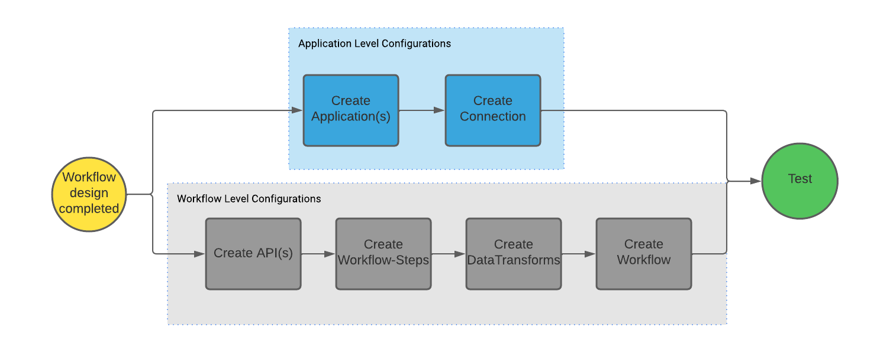

# Configuration Guide

## Introduction

This document is intended to provide an overview of the configuration objects present in the Nordic Health Data Connector. It is recommended that configuration elements are interacted with using the CRUD endpoints provided to ensure that data integrity, access control, and security is maintained. 

## Interacting with REST Endpoints - CRUD

The Health Data Connector is designed for easy configurability via REST endpoints. Full CRUD operations are available for each configuration element including:

- Applications
- Connections
- APIs
- Workflow Steps
- Data Transforms
- Workflows

### Build Order - Configurable Elements

The Health Data Connector relies on all configurable elements to create an executable workflow. Each configurable element is built with the intention of reusability resulting in interdependency of elements. The following build order is recommended when creating net new executable workflows:

### Configuration Relationship Diagram

## Application Level Configurations

:::info
All configuration parameters are string values unless explicitly stated.
:::

### 1 - Applications

### Definition

Application level configurations hold data related to the application registered with the EHR. This configuration contains information such as client-id, secret, and scope. Application level configurations are required to complete SMART on FHIR, FHIR, or REST actions. 

### Configuration Parameters

Application level configurations hold data related to the application registered with the EHR. This configuration contains information such as client-id, secret, and scope. Application level configurations are required to complete SMART on FHIR, FHIR, or REST actions. 

|Name|Description|Required?|Notes|
|:-|:-|:-|:-|
| applicationId| Unique ID used to store and refer to the application configuration.| Yes| Must be unique|
| name| Vanity name for human readable purposes.| Yes| |
| appType| Application type associated with the application registered to the EHR.| Yes| Enum: <ul><li>Backend</li><li>ProviderLaunch</li><li>PatientLaunch</li></ul>|
| ClientId| Client ID is a value provided by the EHR vendor to uniquely identify the application when communicating with the EHR.| Yes| |
| scopes| Used to identify the scopes associated with the application.| Conditional| Required for SMART launch configuration.|
| privateKeyName| Workflow Id to execute upon a SMART launch success.| Yes| |
| authSuccessWorkflowId| Workflow Id to execute upon a SMART launch success. | Conditional| Required for SMART launch configuration.|
| authFailureWorkflowId | Workflow Id to execute upon a SMART launch failure.| Conditional| Required for SMART launch configuration.|
| launchParameters| Defines launch parameters for SMART launch configuration.| Conditional| Required for SMART launch configuration.|

